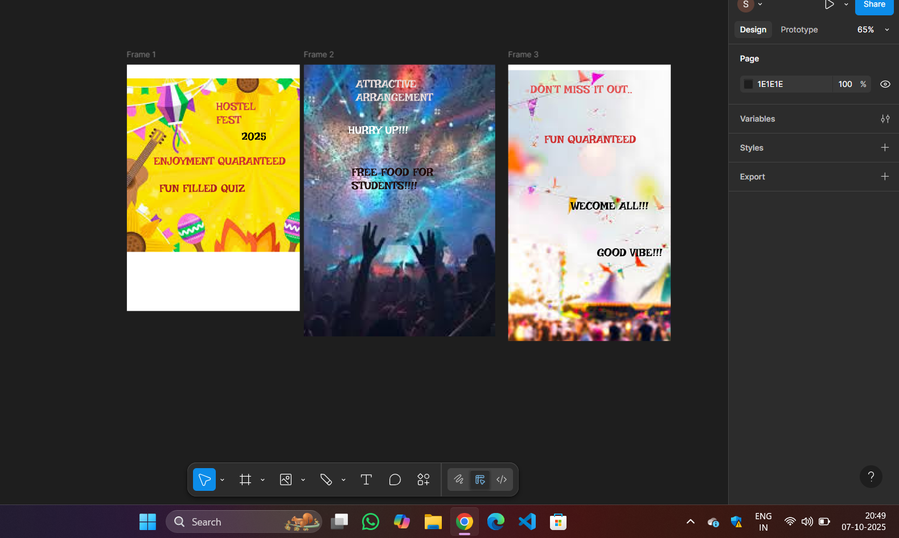

# Ex09 Event Registration Web Application
# Date:07.10.2025
# AIM:
To design, develop and deploy a web application for event registration.

# DESIGN STEPS:
## Step 1:
Create a new frame.

## Step 2:
Select any one preset size of your choice.

## Step 3:
Select the shapes you need.

## Step 4:
Import images as needed.

## Step 5:
Create pages based on your need and link them.

## Step 6:
Validate the HTML and CSS code.

## Step 6:
Publish the website in the given URL.

# DESIGN TOOL:
Figma

# CODE:
```
<!DOCTYPE html>
<html>
  <head>
    <meta name="viewport" content="width=device-width, initial-scale=1" />
    <meta charset="utf-8" />
    <link rel="stylesheet" href="globals.css" />
    <link rel="stylesheet" href="style.css" />
  </head>
  <body>
    <div class="frame">
      
      <div class="text-wrapper">FUN FILLED QUIZ</div>
      <div class="div">2025</div>
      <div class="text-wrapper-2">HOSTEL FEST</div>
      <div class="text-wrapper-3">ENJOYMENT QUARANTEED</div>
    </div>
  </body>
</html>
@import url("https://cdnjs.cloudflare.com/ajax/libs/meyer-reset/2.0/reset.min.css");
* {
  -webkit-font-smoothing: antialiased;
  box-sizing: border-box;
}
html,
body {
  margin: 0px;
  height: 100%;
}
/* a blue color as a generic focus style */
button:focus-visible {
  outline: 2px solid #4a90e2 !important;
  outline: -webkit-focus-ring-color auto 5px !important;
}
a {
  text-decoration: none;
}
.frame {
  background-color: #ffffff;
  width: 100%;
  min-width: 374px;
  min-height: 533px;
  position: relative;
}

.frame .sruthi {
  position: absolute;
  top: 28px;
  left: 0;
  width: 374px;
  height: 379px;
  aspect-ratio: 1.49;
}

.frame .text-wrapper {
  position: absolute;
  top: 253px;
  left: 70px;
  font-family: "Irish Grover-Regular", Helvetica;
  font-weight: 400;
  color: #ac2121;
  font-size: 24px;
  letter-spacing: 0;
  line-height: normal;
}

.frame .div {
  position: absolute;
  top: 141px;
  left: 248px;
  width: 56px;
  font-family: "Irish Grover-Regular", Helvetica;
  font-weight: 400;
  color: #000000;
  font-size: 24px;
  letter-spacing: 0;
  line-height: normal;
}

.frame .text-wrapper-2 {
  position: absolute;
  top: 76px;
  left: 193px;
  width: 111px;
  font-family: "Irish Grover-Regular", Helvetica;
  font-weight: 400;
  color: #cd3f3f;
  font-size: 24px;
  letter-spacing: 0;
  line-height: normal;
}

.frame .text-wrapper-3 {
  position: absolute;
  top: 194px;
  left: 58px;
  width: 303px;
  font-family: "Irish Grover-Regular", Helvetica;
  font-weight: 400;
  color: #cd2e2e;
  font-size: 24px;
  letter-spacing: 0;
  line-height: normal;
}
<!DOCTYPE html>
<html>
  <head>
    <meta name="viewport" content="width=device-width, initial-scale=1" />
    <meta charset="utf-8" />
    <link rel="stylesheet" href="globals.css" />
    <link rel="stylesheet" href="style.css" />
  </head>
  <body>
    <div class="frame">
      
      <div class="text-wrapper">HURRY UP!!!</div>
      <div class="div">FREE FOOD FOR STUDENTS!!!!</div>
      <div class="ATTRACTIVE">ATTRACTIVE <br />ARRANGEMENT</div>
    </div>
  </body>
</html>
@import url("https://cdnjs.cloudflare.com/ajax/libs/meyer-reset/2.0/reset.min.css");
* {
  -webkit-font-smoothing: antialiased;
  box-sizing: border-box;
}
html,
body {
  margin: 0px;
  height: 100%;
}
/* a blue color as a generic focus style */
button:focus-visible {
  outline: 2px solid #4a90e2 !important;
  outline: -webkit-focus-ring-color auto 5px !important;
}
a {
  text-decoration: none;
}
.frame {
  background-color: #ffffff;
  width: 100%;
  min-width: 413px;
  min-height: 588px;
  position: relative;
}

.frame .sruthi {
  position: absolute;
  top: 0;
  left: 0;
  width: 413px;
  height: 588px;
  aspect-ratio: 0.53;
  object-fit: cover;
}

.frame .text-wrapper {
  position: absolute;
  top: 127px;
  left: 96px;
  font-family: "Irish Grover-Regular", Helvetica;
  font-weight: 400;
  color: #ffffff;
  font-size: 24px;
  letter-spacing: 0;
  line-height: normal;
}

.frame .div {
  position: absolute;
  top: 218px;
  left: 103px;
  width: 189px;
  font-family: "Irish Grover-Regular", Helvetica;
  font-weight: 400;
  color: #1f0a0a;
  font-size: 24px;
  letter-spacing: 0;
  line-height: normal;
}

.frame .ATTRACTIVE {
  position: absolute;
  top: 27px;
  left: 112px;
  width: 226px;
  font-family: "Irish Grover-Regular", Helvetica;
  font-weight: 400;
  color: #e8dbdb;
  font-size: 24px;
  letter-spacing: 0;
  line-height: normal;
}
<!DOCTYPE html>
<html>
  <head>
    <meta name="viewport" content="width=device-width, initial-scale=1" />
    <meta charset="utf-8" />
    <link rel="stylesheet" href="globals.css" />
    <link rel="stylesheet" href="style.css" />
  </head>
  <body>
    <div class="frame">
      
      <div class="text-wrapper">FUN QUARANTEED</div>
      <div class="div">DON’T MISS IT OUT..</div>
      <div class="text-wrapper-2">WECOME ALL!!!</div>
      <div class="text-wrapper-3">GOOD VIBE!!!</div>
    </div>
  </body>
</html>
@import url("https://cdnjs.cloudflare.com/ajax/libs/meyer-reset/2.0/reset.min.css");
* {
  -webkit-font-smoothing: antialiased;
  box-sizing: border-box;
}
html,
body {
  margin: 0px;
  height: 100%;
}
/* a blue color as a generic focus style */
button:focus-visible {
  outline: 2px solid #4a90e2 !important;
  outline: -webkit-focus-ring-color auto 5px !important;
}
a {
  text-decoration: none;
}
.frame {
  background-color: #ffffff;
  width: 100%;
  min-width: 351px;
  min-height: 598px;
  position: relative;
}

.frame .sruthi {
  position: absolute;
  top: 12px;
  left: 0;
  width: 351px;
  height: 586px;
  aspect-ratio: 1;
  object-fit: cover;
}

.frame .text-wrapper {
  position: absolute;
  top: 147px;
  left: 78px;
  font-family: "Irish Grover-Regular", Helvetica;
  font-weight: 400;
  color: #cf2f2f;
  font-size: 24px;
  letter-spacing: 0;
  line-height: normal;
}

.frame .div {
  position: absolute;
  top: 39px;
  left: 48px;
  width: 287px;
  font-family: "Irish Grover-Regular", Helvetica;
  font-weight: 400;
  color: #e15454;
  font-size: 24px;
  letter-spacing: 0;
  line-height: normal;
}

.frame .text-wrapper-2 {
  position: absolute;
  top: 291px;
  left: 135px;
  width: 186px;
  font-family: "Irish Grover-Regular", Helvetica;
  font-weight: 400;
  color: #000000;
  font-size: 24px;
  letter-spacing: 0;
  line-height: normal;
}

.frame .text-wrapper-3 {
  position: absolute;
  top: 392px;
  left: 192px;
  font-family: "Irish Grover-Regular", Helvetica;
  font-weight: 400;
  color: #000000;
  font-size: 24px;
  letter-spacing: 0;
  line-height: normal;
}


```
# OUTPUT:


# RESULT:
The program to design, develop and deploy a web application for event registration is completed successfully.
